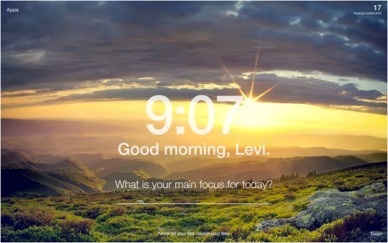
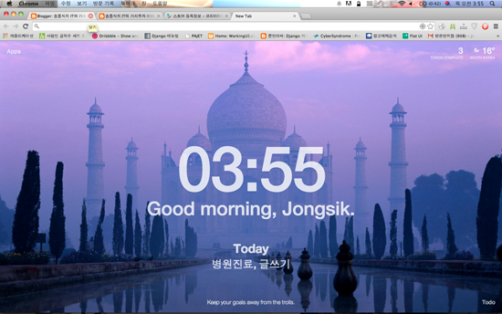

# 오픈소스SW 기말 과제

- 프로젝트 안내
  - 이번 프로젝트는 크롬 시작 페이지에 '시간'과 '오늘 해야할 일'을 띄워주는 앱을 만드는 프로젝트이다.
  - 
  - 

* 어떻게 진행할 것인가

  - html, css, javascript를 활용해 일상 생활에 도움을 줄 수 있는 todolist 앱을 개발할 것이다.
  - 한번에 많은 양을 커밋하지 않고 양이 적어도 수시로 커밋을 할 것이다.

* 참여인원
  * 1명(개인 프로젝트)
