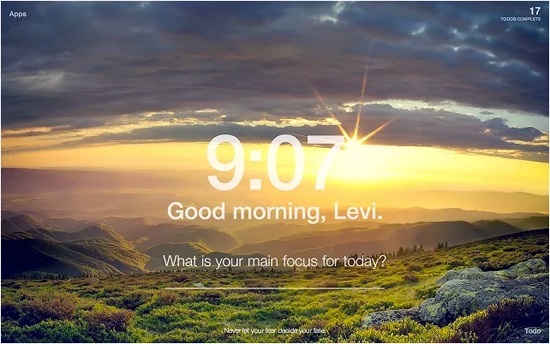
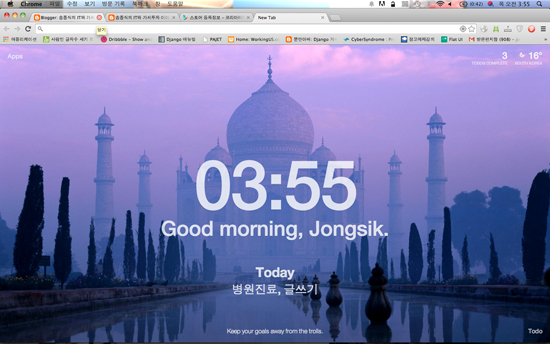
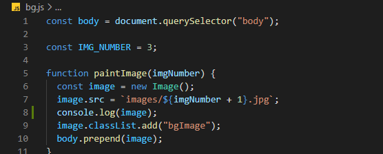
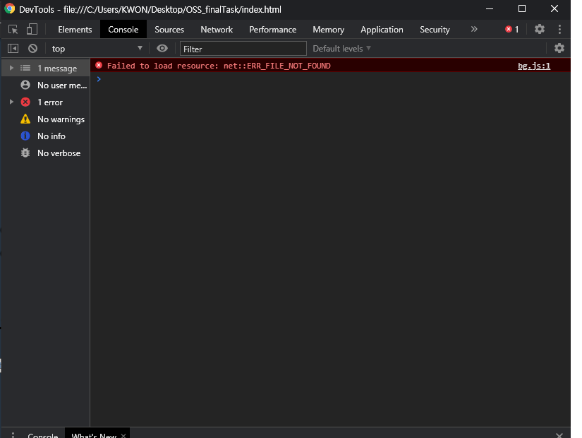

# 오픈소스SW 기말 과제

- 프로젝트 안내
  - 이번 프로젝트는 크롬 시작 페이지에 '시간'과 '오늘 해야할 일'을 띄워주는 앱을 만드는 프로젝트이다.
  - 
  - 

* 어떻게 진행할 것인가
  - https://nomadcoders.co/javascript-for-beginners 해당 사이트의 강의와 함께 개발 진행
  - 뼈대를 잡은 후 CSS와 기능을 추가하여 실제 사용이 가능하도록 진행
  - html, css, javascript를 활용해 일상 생활에 도움을 줄 수 있는 todolist 앱을 개발할 것이다.
  - 한번에 많은 양을 커밋하지 않고 양이 적어도 수시로 커밋을 할 것이다.

* 참여인원
  * 1명(개인 프로젝트)
  
* 사용법
  > (1) git clone   
  > (2) index.html 파일을 통해 이용
  
* 오류
  * 
  * 
  * 배경화면이 나오지 않는 오류가 발생
  * Console.log를 통해 해당 javascript 함수 내에서 image.src에 파일이 제대로 입력되지 않은 것 확인 
  * 파일명이 bs로 변경되어 있었음을 확인 ==> bs.js를 bg.js로 변경
  
* 기여 방법
  * 수정사항 혹은 추가 기능에 대한 기여는 Fork후 PullRequest로 부탁드립니다.
  

